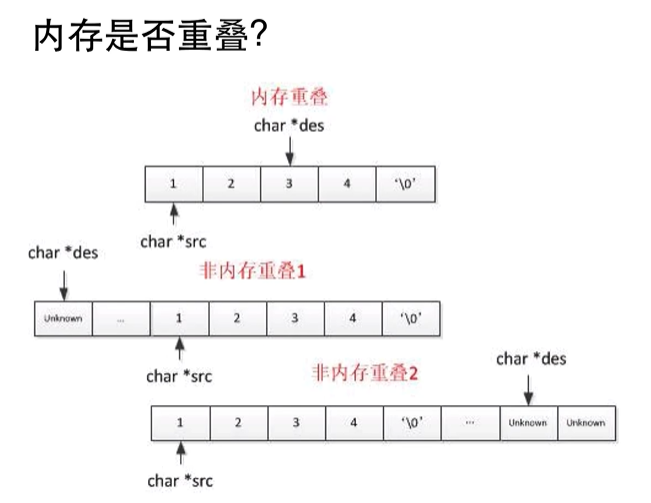

* 数组元素 无法删除 ,只能   覆盖 
* 内存中存储方式:   **数组是存放在连续内存空间上的相同类型数据的集合***

## C语言陷阱 - 开发经验总结

---

* 内存重叠 的处理 

  * 

    >   第一种情况 :  待插入位置 在 后面, 且 间距 小于n  必定出现 数据丢失情况 
    >
    >   第三种情况 :  待插入位置 在后面, 但间距 大于 n ,不会出现 内存重叠情况
    >
    >   第二种情况 :  待插入位置 在前面, 但间距 小 n ,不会出现 内存重叠情况      

* 临时变量太多 或  没有安全释放 

* 没有测试内存越界 

* 指针操作不熟悉  

---

# 代码随想录

---

>  暴力删除数组

> 快慢指针法 

> 二分查找 -  中间值在哪边 , 哪边就缩小 
