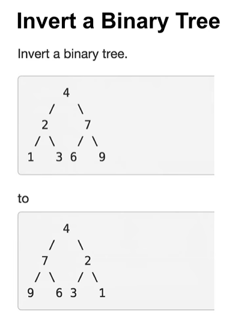

> 反转 二叉树

---

> 面试考察基本功 
>
> * 程序风格 (缩进, 括号,  变量名)
> * 编程习惯 (异常检查, 边界处理)
> * 沟通(理解意图)
> * 测试(主动写出 合理的Testcase)
>
> ---
>
> 1. 变量命名 参考 Google 或微软 编程语言规范 
> 2. <代码大全> 

> 实战算法策略 
>
> * 总结归类相似题目
> * 找出适合 同一类题目的 模板程序 
> * 对 基础题熟练掌握 
>   * 重视 题目的质量,不对 刷题的数量做要求 
>   * 建立 题目模型  ,  分析问题时 确认题目模型 ,  做题时  训练题目模型 